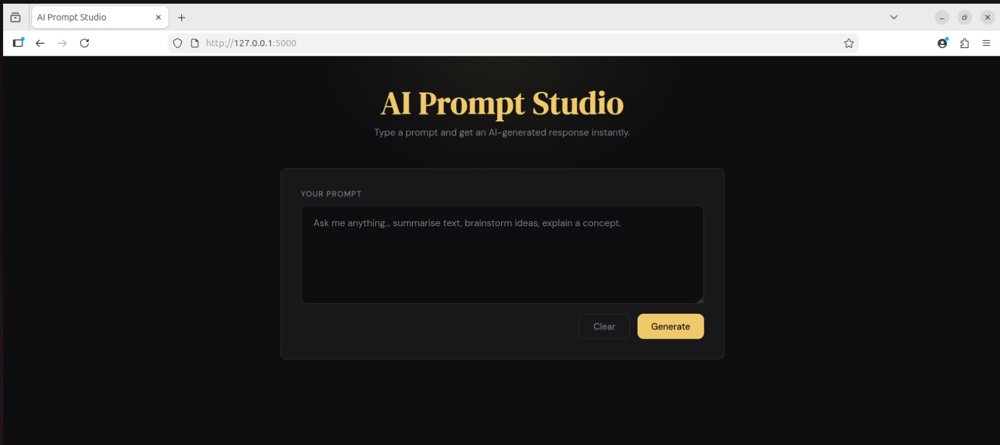
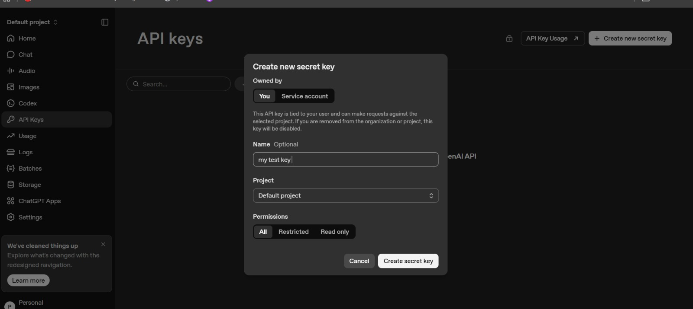

# AI Prompt Studio — Flask App

A minimal Flask web application that accepts a user prompt and returns an AI-generated response using the Anthropic API.


## Setup

### 1. Install dependencies

```bash
pip install -r requirements.txt
```

### 2. Set your API key

**Never hardcode API keys.** Export the key as an environment variable:

Or create a `.env` file and use `python-dotenv` (not included by default):

```
GEMINI_API_KEY=your_key_here
```

### 3. Run the app

```bash
python app.py
```

Visit `http://127.0.0.1:5000` in your browser.






